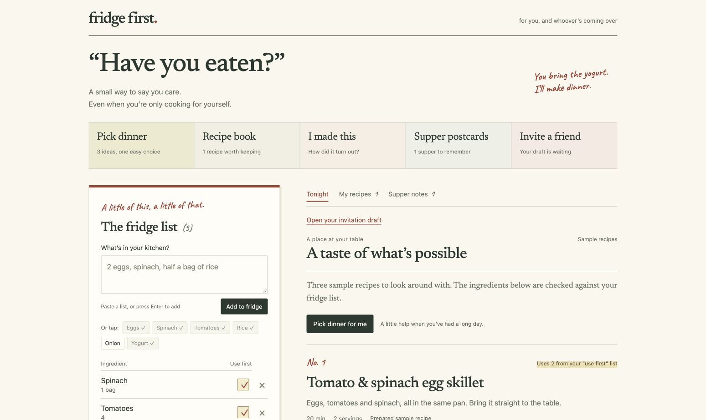
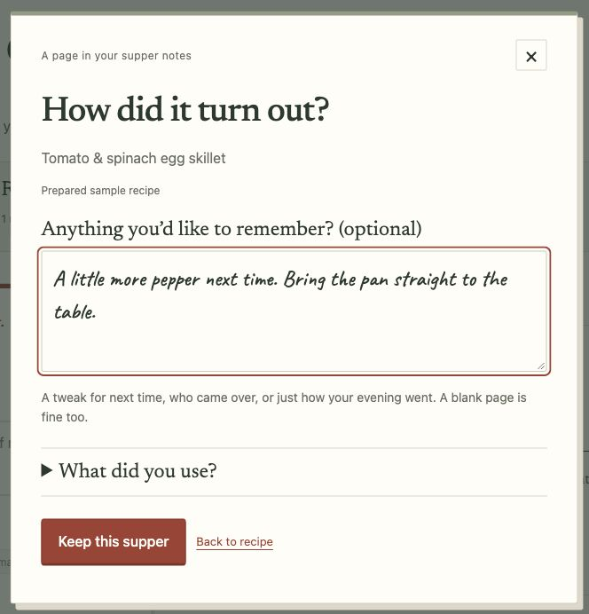
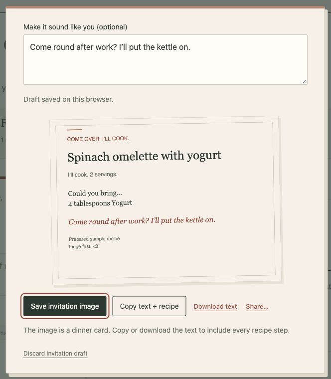

# fridge first.

### “Have you eaten?”

A kitchen notebook for the people you feed. Including yourself.

Start with what’s in the fridge. Find something to cook. Keep the recipe, the extra lemon you’d add next time, and a few words about the evening. When you feel like company, send someone a simple invitation: **you bring one thing, I’ll cook.**



[Try it locally](#run-it) · [The little things](#the-little-things) · [How it works](#how-it-works) · [Development notes](docs/DEVELOPMENT.md)

## The little things

**Dinner, with one less decision.** Paste a list like `2 eggs, spinach, half a bag of rice`. Mark what needs using, choose your time and servings, and ask Gemma for three ideas. **Pick dinner** helps you choose from the menu.

**A recipe book that gets more personal.** Save something you want to make again. After cooking, leave a note. It comes back beside the recipe next time, so the small changes you liked don’t get lost.

**A reason to ask someone over.** Choose an ingredient a friend could bring, write a message, and make an invitation. Or leave the ingredients unticked: just bring yourself.

| A few words for next time | Dinner doesn’t need an occasion |
| --- | --- |
|  |  |
| **I made this** starts with how it went. Updating what’s left in the fridge sits underneath. | Preview your invitation, then save the image or copy the text with the full recipe. |

Supper notes also become **postcards**: a dated recipe and your own words, saved as an image or text. A little of the evening, kept.

*These are real screenshots of the app using prepared sample recipes and example notes. They do not show live Gemma output.*

## Run it

With **Node.js 20+**, run this from the project folder:

```sh
npm start
```

Open **[localhost:4173](http://localhost:4173)**. No package installation, API key, account, or separate inference server is needed.

To explore without a model download, choose **Have a peek at an example**. Open a recipe, keep it, choose **I made this**, and leave a note. You can try the recipe book, postcards, and invitations this way.

For new recipe suggestions, use a browser with working **WebGPU** support and click **What could I cook?** The first model download can take several minutes. **Cancel** or **Stop Gemma and free memory** stops the worker. The model never starts just because you opened the app.

Use the localhost address rather than opening `dist/index.html` directly.

## How it works

**Gemma suggests. The app checks. You make it yours.**

Gemma 3 1B runs through WebLLM in a browser Web Worker. It receives your ingredients, time, and serving preferences and returns structured recipes. The app validates the results and checks ingredient availability against your list before displaying them.

Your fridge, recipes, notes, and invitation draft are kept in browser storage. Inference happens on your device. Initial model/runtime downloads and Google Fonts need network access; full offline use is not guaranteed. There is no cross-device sync, and clearing browser storage can remove your notebook.

A few deliberate choices:

- **Amounts stay manual.** After cooking, you decide what stays, what is finished, and what quantity is left. Undo protects later fridge edits.
- **Sharing stays in your hands.** Invitations are drafts until you copy, download, or share them. Nothing is sent automatically.
- **Examples are labelled.** Invalid model output produces an error; sample recipes are never passed off as generated results.

Times and quantities are estimates. Saved recipes retain their original servings. The app does not determine food safety or enforce allergy restrictions.

## Built simply

Plain HTML, CSS, and JavaScript. No build step. The editable app lives in `dist/`; the Node server is `serve.mjs`.

```sh
npm run check
npm test
```

**21 automated tests** cover recipe validation, ingredient entry, persistence, safe undo, invitation contents, and export layout. Browser checks cover the sample cooking, recipe-book, postcard, and invitation flows. Live Gemma inference, native sharing, and optional WebMCP registration still need end-to-end verification.

See [development notes](docs/DEVELOPMENT.md) for the file map, storage behavior, model details, and troubleshooting.

## Made with

[Gemma 3](https://ai.google.dev/gemma/docs/core/model_card_3) · [WebLLM](https://github.com/mlc-ai/web-llm) · Newsreader & Caveat · an original kitchen-table illustration

Application code is [MIT licensed](LICENSE). Gemma, WebLLM, and the fonts retain their own terms. Model weights are downloaded separately.

Made for the people you feed, with <3
